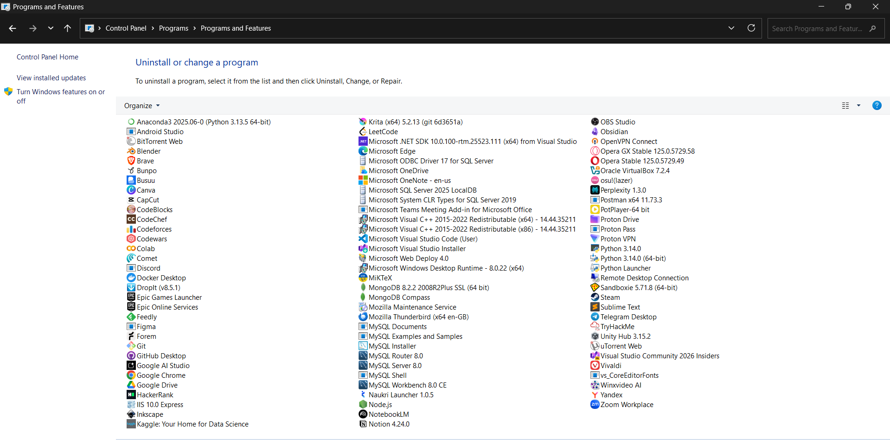
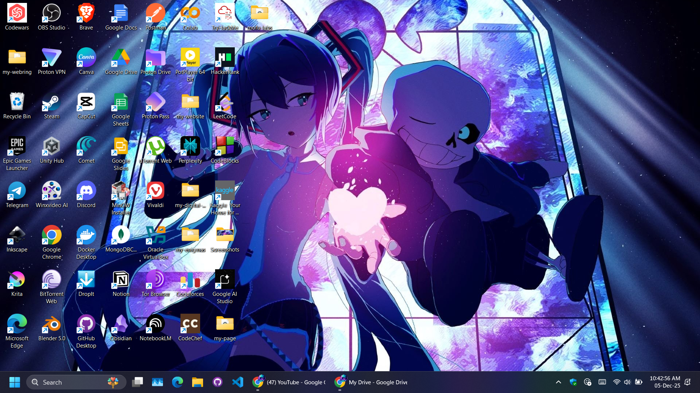
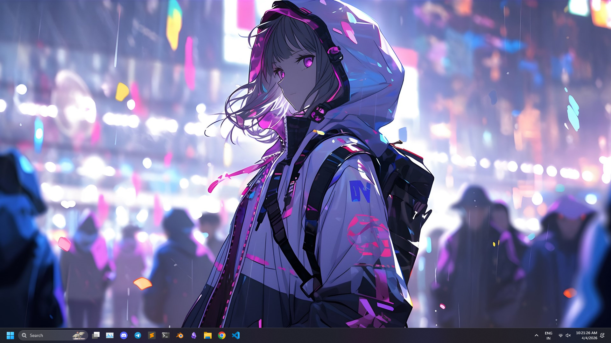

# Windows Config

My personal Windows configuration files and development environment.

This repository contains the configuration and settings I use across my Windows machines. It serves as a backup of my setup and makes it easy to reproduce my workflow.

## Contents

* `vs-code/` – Visual Studio Code settings, extensions, and configuration
* `sublime-text/` – Sublime Text configuration and packages

More applications will be added over time.

## Installed Programs

## Screenshots

Feel free to use these configurations as a reference or adapt them to your own workflow.
